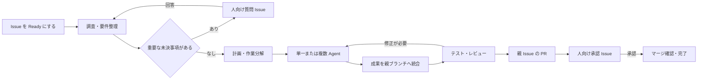

# KANAME 要件・設計・実装計画

記録日: 2026-09-29  
更新日: 2026-10-03
対象: この日までの会話で整理した要件、調査結果、実装方針  
状態: fork のローカル checkout に基盤 PoC を実装し、2026-09-30 にユーザー確認済み。到達点・起動方法・検証結果・未検証事項は [基盤 PoC](foundation-poc.md) に記録する。2026-10-02 に第10節の単一担当による一連の工程を実装・分離環境で検証した。稼働版への反映は未実施。最新仕様と結果は [単一担当の開発ワークフロー](single-assignee-workflow.md) を参照する。

今回の確定範囲は、既存 Task／Pipeline と別の Issue 管理、画面内の対応待ちと通知履歴、新ワークフローのみの利用上限、同一担当での順次実行、対象 SHA の承認と Squash マージ確認。外部通知と複数担当は後続とする。第7節・第10節・第15節の外部通知などの記述より、この今回仕様を優先する。

自己開発の最初の小単位として、[完了時の追加タスク起票](done-followups-spec.md) を実装し、実ブラウザーと両実 CLI の検証後、2026-10-02 に稼働版へ反映した。タスクごとに ON（初期 OFF）、人が Done にした時に同じプロジェクトの Backlog へ起票する。第10節・第15節の一連の工程の完成とは別の追加機能である。変更内容・仕様対応は [実装・検証記録](done-followups-implementation.md)、稼働版への反映結果は [反映記録](done-followups-deployment.md) に記録する。

## 1. 目的

隣接する `kaname` リポジトリの `.docs/agent-system.md` の構想を基に、Kanban と Issue を中心とした Agent 管理システムを作る。

人が依頼を Issue にし、実行を許可すると、単一または複数の Agent が必要な仕事を進める。大まかな要望は調査・要件整理から受け付け、途中で人の判断や作業が必要になった場合は、それも Issue にして非同期に回答を受け取り、中断地点から再開する。初版は実装・検証・レビュー・PR 作成を経て、人の承認後のマージまでを完走できることを目指す。

## 2. ユーザーが選択した方針

| 項目 | 決定 |
|---|---|
| 初期の利用者 | 個人。自分の複数プロジェクトを管理する |
| 利用形態 | PC または自分のサーバーに常駐するサービスと Web UI |
| Issue の正本 | KANAME 内。GitHub Issues は連携対象 |
| Agent の接続方式 | Codex と Claude Code の CLI。既存のログインを利用する |
| Agent の編成 | 上限付きの自動編成。必要に応じて作業を分解する |
| 実行開始 | 人が作成した Issue を Backlog から Ready に移した時点 |
| 自律実行の到達点 | 実装・テスト・修正・PR 作成を進め、人の承認後にマージする |
| 実装の土台 | agetor の fork を拡張する |
| PR の単位 | 親 Issue ごとに一つの PR |
| 依頼の粒度 | 大まかな要望と具体的な仕様の両方。Ready 後に必要な調査・要件整理を行う |
| 実装前の人の確認 | 重要な未決事項がある場合に質問する。毎回の計画承認は必須にしない |
| 離席中の通知 | 対応待ち一覧を正本にし、外部通知を一種類追加する。サービス・宛先は未指定 |
| 累積利用の上限 | 親 Issue と日次の Agent 稼働時間を合算して制限。到達時に停止し、明示操作で再開 |

### PR と子 Issue に関する最新の決定

途中で「子 Issue ごとに個別 PR」を選択したが、その後、数が増えすぎる懸念から見直した。**現在の決定は「親 Issue ごとに一つの PR」**であり、以前の選択を置き換える。

| 単位 | 用途 | 表示・完了の扱い |
|---|---|---|
| 親 Issue | 「ログイン機能の追加」など、人が依頼する成果 | Kanban に表示し、一つの PR で届ける |
| 内部タスク | API 実装、画面実装、テスト、レビューなどの分担 | 親 Issue の詳細に表示。分担ごとに Issue や PR を増やさない |
| 子 Issue | 独立して追跡する必要がある大きな作業 | 必要な場合だけ作成。成果は親の PR に統合する |
| 人向け Issue | 仕様の質問、手作業依頼、権限不足、マージ承認 | 「あなたの対応待ち」に集約し、回答後に関連工程を再開する |

別々にマージ・リリースしたい変更は独立した親 Issue として起票する。初版では「指定した子 Issue だけ個別 PR にする」方式は採用しない。

## 3. 初版の範囲と将来の拡張

初版は、一つのサービスが複数プロジェクトを管理する個人向けの一元管理ツールにする。プロジェクトごとの独立導入や、外部顧客向けの SaaS は初版の主対象にしない。

次は実装計画で採用した初期前提であり、ユーザーが個別の選択肢として指定した事項とは区別する。

- 外部 Git ホスト連携は GitHub を先行させる。
- 自分が信頼するリポジトリと CLI アカウントを対象にする。
- Web UI へのアクセスは localhost または SSH トンネルを基本にする。
- GitHub Issues との双方向同期、組織・テナント分離、課金、自動デプロイは後続段階にする。
- プロジェクト管理と Agent 実行の境界を保ち、将来のリモート Runner や SaaS 化に備える。

2026-09-30 に採用した「曖昧な依頼の受付」「離席中の通知」「累積利用の上限」の詳細は、第15節に記載する。通知先のサービス・宛先は未指定であり、設定前でも対応待ち一覧を利用できる。

## 4. agetor の調査結果と採用理由

参照リポジトリ: <https://github.com/alamops/agetor>  
調査時に確認した upstream コミット: `19fcc12503716f4625598c679849274564d8b131`

個人の複数プロジェクトを既存 CLI で動かす今回の要件では、agetor の fork が最短の土台になるという技術的判断。工数を実測した結論ではない。調査時に未検証だった Linux 上の基盤動作は、2026-09-30 の [PoC 検証](foundation-poc.md) で確認した。

| 領域 | 調査で確認した既存機能 | KANAME で追加・変更する内容 |
|---|---|---|
| 実行基盤 | Bun、SQLite、CLI セッション、tmux 再接続、デスクトップに依存しない headless プロセス | Linux 検証、常駐サービス化、アイドル時の自動終了の無効化 |
| UI | React、Kanban、HTTP API、SSE、ログ・差分表示 | ブラウザー向け配信・認証、同一オリジン対応、ネイティブ専用操作の置き換え |
| 複数 Agent | プロファイル、パイプライン、分岐・並列・合流・ループ、構造化された引き継ぎ | Issue 起点の自動分解、依存関係、スケジューラーによる上限の強制 |
| 人の介入 | 質問や許可要求をカードとして表示 | 永続的な人向け Issue、回答・承認履歴、回答後の自動再開 |
| Git 連携 | Issue 取得・作成・更新、PR 作成・チェック・マージ等の操作 | 実装から人の承認後のマージまでを一つのワークフローに接続 |
| 作業分離 | 上位 Task ごとの worktree | 並列の書き込み担当ごとの worktree と、親ブランチへの直列統合 |

### そのまま流用できない点

- 既存のパイプラインの並列工程は一つの worktree を共有する。同じファイルを複数 Agent が変更する場合の分離が必要。
- 人との pending interaction はメモリー上に保持され、再起動時に tmux の表示から復元する部分がある。人向け Issue の永続化とは分けて設計する。
- 一部の Agent 委譲上限はプロンプト上の指示であり、スケジューラーによる強制ではない。
- パイプラインの永続化や復旧はあるが、複数プロセス間のジョブ所有権や、Issue の依存関係を管理する仕組みとは異なる。
- ブラウザー用 API の接続先に localhost 前提があり、単にサーバーの bind アドレスを変えるだけでは Web 版にならない。
- macOS 中心の配布で、調査時点で Linux の公式なビルド・テスト実績は確認できていない。

責務は、**KANAME が Issue・依存関係・実行ポリシー・人の判断・完了判定を管理し、agetor 由来の部品が CLI セッション・ログ・worktree・Git 操作・UI の基盤を担う**形に分ける。

調査ではテスト・spec ファイルを 317 件確認したが、これはカバレッジや成功を示す数値ではない。この会話では upstream のテストを実行していない。

### 調査の参照先

- [README と構成](https://github.com/alamops/agetor/tree/19fcc12503716f4625598c679849274564d8b131)
- [headless プロセス](https://github.com/alamops/agetor/blob/19fcc12503716f4625598c679849274564d8b131/src/bun/headless.ts)
- [HTTP サーバー](https://github.com/alamops/agetor/blob/19fcc12503716f4625598c679849274564d8b131/src/bun/server.ts)
- [ブラウザー側 API](https://github.com/alamops/agetor/blob/19fcc12503716f4625598c679849274564d8b131/src/mainview/lib/api.ts)
- [人との interaction](https://github.com/alamops/agetor/blob/19fcc12503716f4625598c679849274564d8b131/src/bun/interactions.ts)
- [パイプライン実行](https://github.com/alamops/agetor/blob/19fcc12503716f4625598c679849274564d8b131/src/bun/pipeline-runner.ts)
- [パイプライン実行のテスト](https://github.com/alamops/agetor/blob/19fcc12503716f4625598c679849274564d8b131/src/bun/pipeline-runner.test.ts)
- [MIT ライセンス](https://github.com/alamops/agetor/blob/19fcc12503716f4625598c679849274564d8b131/LICENSE)

## 5. 技術構成と UI

- TypeScript・Bun・React・SQLite を継承する。upstream の出自とライセンス表記を保持する。
- 初版は HTTP API、Web UI、実行スケジューラー、CLI Runner を同一ホストに配置する。
- UI と API を同一オリジンで提供し、ブラウザー認証と SSE による進捗配信を備える。
- Linux の systemd 設定を用意し、ブラウザーを閉じても実行を続ける。
- デスクトップのファイル選択や OS アプリ起動などは Web UI 向けの操作に置き換える。
- Codex と Claude Code の起動、構造化イベント、再開、停止を共通アダプターで扱う。

| 画面 | 主な内容 |
|---|---|
| 全体／プロジェクト別 Kanban | 親 Issue、優先順位、実行状態、待機理由 |
| Issue 詳細 | 要件案と前提、計画、内部タスク、子 Issue、Agent のログ、差分、検証結果、PR、累積稼働時間、停止理由 |
| あなたの対応待ち | 質問、手作業依頼、権限不足、マージ承認への回答、通知失敗の表示 |

内部タスクと子 Issue は親の詳細内で展開し、通常の Kanban を細かな作業で埋めない。

## 6. 自律実行の流れ



### 開始と分解

- 人が作成した Issue は Backlog に置き、Ready への移動を実行許可とする。
- Ready 後に必要な調査・要件整理を行い、受け入れ条件と方針を親 Issue に保存する。重要な未決事項だけ人に質問し、回答後に対象工程を再開する。
- Planner が単一担当か複数担当かを提案する。サーバーが依存関係と上限を検証して起動する。
- 許可済みの親 Issue の範囲内で分解した作業は自動実行する。
- 依存関係の循環を拒否し、同じ Issue の有効な実行が重複しないようにする。

### 並列作業と一つの PR への統合

- 並列に書き込む Agent はそれぞれの branch／worktree を使う。同じ作業ディレクトリの書き込み担当は常に一人にする。
- 成果物として基準 SHA、確定したコミット、検証結果を記録し、親ブランチへの統合を直列化する。
- 統合済みの成果物を記録し、再試行による二重取り込みを防ぐ。
- 子の成果が親に入った状態を「統合済み」とする。内部の依存関係はこの時点で解消する。
- 親は子の「完了」を待たず、必要な成果が統合されたら最終検証へ進む。親 PR のマージ確認後に親と子を「完了」にする。
- テストとレビューは統合後の確定したコードを対象とする。PR の作成・承認・マージは親 Issue に集約する。

### 修正と上限

- CI やレビューの指摘は自動修正へ戻す。
- 自動修正上限を超えた失敗や解決できない競合は、状況・試した内容・必要な判断を添えた人向け Issue にする。
- 待ち合わせ中の coordinator は実行枠を解放する。親が枠を保持して子を起動できない状態を防ぐ。
- Agent 編成は KANAME に集約する。CLI 内部の追加委譲を無効化し、アダプターごとに動作を確認する。無効化を検証できない状態を「全 Agent 数の強制上限あり」と扱わない。

## 7. 人への依頼とマージ承認

- 人向け Issue に、依頼種別・対象工程・質問内容・再開条件を保存する。
- 単なるクローズと、回答・承認・差し戻しを区別する。回答が記録され、必要な依頼が解決し、ほかの停止理由がない場合にだけ自動再開する。累積利用上限による停止からの再開は、第15.3節に従って明示操作を必要とする。
- 人の回答待ちでは CLI の実行枠を解放する。無関係な仕事は進められるようにする。
- 再開は保存された工程・成果・回答から行う。元の CLI セッションを再利用できなくても、工程を復元できるようにする。
- マージ承認は PR と head SHA に結び付ける。承認後の追加変更や子の再実行で確認対象が変わった場合は、検証と承認を取り直す。
- マージ直前に必須チェック、承認対象の SHA、競合状態、未解決の blocker を確認する。
- GitHub 上で実際にマージされたことを確認して完了にする。マージ要求の受付やタイムアウトだけでは完了と判定しない。
- PR 作成・push・マージは管理サービスの処理に集約する。ただしワークフロー上の承認ゲートと、同一 OS ユーザーで動く Agent の権限分離は別の設計課題として扱う。
- 質問・承認待ち・上限接近・停止・完了を外部通知する。配信に失敗しても対応待ち一覧を保持し、回答・承認は認証済み Web UI で受け付ける。配信条件は第15.2節に従う。

参考: [GitHub の PR マージ API](https://docs.github.com/en/rest/pulls/pulls#merge-a-pull-request)

## 8. 永続化・インターフェース・復旧

agetor の実行用 Task と、利用者の Issue は別の概念として管理する。

| 型・境界 | 責務 |
|---|---|
| `Project` | リポジトリ、基準ブランチ、検証コマンド、Agent 設定、実行上限 |
| `Issue` | 依頼、受け入れ条件、親子関係、依存関係、人への依頼 |
| `WorkflowRun` | Issue に対する長期の進行状態、工程、再開情報、停止理由 |
| `AgentAttempt` | 個々の CLI 実行、役割、セッション、worktree、結果、再試行 |
| `Artifact` | 要件案とその版、コミット、検証結果、レビュー結果、PR、ログへの参照 |
| `HumanDecision` | 回答・承認・差し戻し、対象工程と要件案の版、承認対象 SHA |
| 永続ジョブ・イベント | 次の処理、実行所有権、処理履歴、重複防止、通知と配信状態 |
| 利用時間・予約 | 親 Issue と日次の累積、並列実行の予約と精算、停止期限と復旧情報 |
| `RunnerAdapter` | CLI の起動、構造化イベント、結果取得、再接続、停止 |

Issue 操作、回答、実行制御を HTTP API として公開し、進捗を SSE で配信する。Agent の構造化結果は「完了・分解提案・人への依頼・失敗」に正規化する。Agent の提案を検証してサーバーが状態更新し、Kanban はその状態を表示する。

状態更新と次のジョブの登録は SQLite の同一トランザクションで行う。再起動時は CLI プロセス、worktree、ブランチ、PR の実態を照合する。heartbeat の途絶だけで二重起動しない。キャンセル後の遅延イベントによる再開も防ぐ。

参考:

- [Codex の非対話実行・JSON 出力・セッション再開](https://learn.chatgpt.com/docs/non-interactive-mode)
- [Claude Code のプログラム実行](https://code.claude.com/docs/en/headless)

## 9. 計画上の初期値

以下は提示済み計画の初期値。ユーザーが数値を個別指定したものではなく、運用設定として変更できるようにする。

| 項目 | 初期値 |
|---|---|
| 同時進行する親 Issue | 全体で二件、プロジェクトごとに一件 |
| CLI の同時実行 | 全体で三つまで |
| 親 Issue 内の作業項目 | 最大十二件 |
| 作業分解の深さ | 二段階まで |
| 各工程の自動再試行 | 二回まで。最初の実行を含めると最大三回 |
| CLI 一回の実行時間 | 三十分。プロジェクト設定で変更可能 |
| 人の回答待ち | CLI の実行時間上限に含めない |

待機中は実行枠を解放する。上限を自動で拡大せず、上限超過は理由を示して人への依頼にする。

累積稼働時間は親 Issue ごと2 Agent 時間、全体で一日6 Agent 時間を試用の初期値とする。並列担当・再試行も合算し、80%で通知、上限で停止する。日次枠の回復だけでは停止した Issue を再開しない。集計と停止・再開の詳細は第15.3節に従う。

## 10. 実装順序と受け入れ条件

### 実装順序

1. 確認済みの fork・配置先・基準コミットを基に、upstream との差分と既存セキュリティ資料の対象を照合する。
2. Linux 上で headless サービス、Web UI、両 CLI の起動・停止・再接続を成立させる。
3. 単一担当で「Issue → 調査・要件整理 → 実装 → 検証 → 自己レビュー → PR → 人の承認 → マージ」を通す。質問と回答後の再開、画面内通知、累積時間の保存と上限停止を実装・検証済み。実 GitHub 書き込みを含む試用と稼働反映は未実施。外部通知は後続。
4. 自動分解、複数 Agent、worktree 分離、親ブランチへの統合を追加する。
5. 再起動、通信断、上限到達、キャンセルを検証し、複数プロジェクトで試用する。

### 受け入れ条件

- 単一・複数 Agent のどちらでも、親 Issue に一つだけ PR が作られる。
- 子の「統合済み」で後続工程が進み、親 PR のマージ確認で親と子が「完了」になる。
- 人待ち中も別の仕事が進み、回答後に保存された工程から再開する。
- 関係のない人向け Issue を解決しても再開しない。未解決の blocker が残る場合は待機を続ける。
- 統合直後や PR 作成直後の再起動でも、成果の二重適用・重複 PR・二重起動を起こさない。
- テスト失敗、統合競合、認証不足で無限ループせず、必要な対応が Issue 化される。
- 古いコミットへの承認ではマージされない。マージ API の応答を失っても実態を照合できる。
- 親のキャンセルで未完了の子も停止し、遅延イベントで再開しない。
- CLI 内部の追加委譲の無効化と、KANAME が管理する実行数の上限を検証する。
- 親が子を待つ間に実行枠を返し、並列数一でも待ち合わせで詰まらない。
- 依頼の受付・通知・累積利用上限は、第15.4節の受け入れ条件も満たす。

現在の開発作業では、実際の GitHub リポジトリへの書き込みを検証に使わず、API モックで PR 作成・承認・マージを検証する。

## 11. fork とリポジトリ配置

### 決まっていること

- ユーザーが agetor の fork を作成済み。
- こちらから GitHub 上に fork を作成する必要はない。
- fork を基に KANAME のアプリケーションを改修する方針。

### 現在確認できる配置

```text
/home/nirila/project/
├── kaname/       # 元の構想資料（.docs/agent-system.md）
└── agetor/       # 現在の fork の checkout
    └── kaname-doc/
```

2026-09-29 の現状確認で、`/home/nirila/project/agetor` の origin は `git@github.com:niwaniwa/agetor.git`、ブランチは `main`、HEAD は第4節の調査済みコミットと同じ `19fcc12503716f4625598c679849274564d8b131` だった。KANAME 固有の改修はまだ行っていない。

当初は独立した `kaname-app` への clone を提案したが、現在は上記の checkout が存在する。新たな clone やフォルダー名の変更を実装開始の前提にしない。アプリの実装・テスト・履歴は fork 側で管理する。

構想資料側の `kaname` は別リポジトリであり、その origin `git@github.com:niwaniwa/kaname.git` とアプリの fork を混同しない。

## 12. 現在の開発作業の制約と実施状況

ユーザーから「外部影響が考えられる write な git 操作は辞めてほしい」と指示がある。

この指示に従い、現在の開発作業では次を守る。

- GitHub 上の fork 作成、push、PR 作成・マージ、公開を行わない。
- 既存リポジトリの remote 設定や既存履歴を書き換えない。当初は commit も禁止だったが、2026-10-02 にユーザーが現在の PoC 状態を基準として保存するローカルコミットを明示的に指示した。この一件のコミットは許可され、push や以後の自動コミットは許可されていない。
- ローカルの実装・文書作成と、リモートの読み取り専用取得を区別する。
- 現在の checkout を利用する。この会話で新たな clone や配置変更は行っていない。
- 製品に PR 作成・マージ機能を実装することと、開発中に実際のリモートを書き換えることを混同しない。GitHub 書き込みのテストはモックを使う。
- 外部通知の配信テストもモックを使い、実サービスへの送信は行わない。

基盤 PoC 着手前までの作業は、ローカル資料と環境の確認、agetor と公式 CLI ドキュメントの読み取り調査、要件整理、本ドキュメントの作成、現 checkout との照合、および第15節の具体化と採用方針の反映だった。2026-09-30 の基盤 PoC では、この checkout の改修、検証用 Bun・依存関係の準備、関連テストと一時ディレクトリの実 CLI 検証へ進んだ。結果と制限は [基盤 PoC](foundation-poc.md) に記録する。Git 操作制約は維持する。

調査時の環境は Linux で、Node.js・tmux・Docker・Codex・Claude Code が見つかった。CLI は Codex `0.156.1`、Claude Code `2.1.241`。Bun はその時点の PATH 上には見つからなかった。実装開始時に再確認する。

## 13. 既存セキュリティ資料の扱い

`kaname-doc` には、今回の書き出し前から次の資料があった。

- [セキュリティレビュー検証結果](security-review-validation.md)
- [実装中心のレビュー](fable-sec-check.md)
- [敵対的脅威モデルのレビュー](codex-sec-check.md)

検証結果文書には 2026-09-10 の静的レビューと記載されている。この会話で調査した upstream コミットとの一致や、ユーザーの fork での修正状況は未確認。今回の文書化で攻撃再現や再検証はしていない。

既存資料は、worktree がセキュリティ境界ではないこと、同一 OS ユーザーの資格情報へアクセスし得ること、設定ファイルの symlink、信頼確認の自動承認、Git の補助プログラム、開発 UI へのトークン注入などを指摘している。導入時に対象コミットを照合し、現在も該当する項目を切り分ける。

これらの資料を、本計画によって修正済み・検証済みになったものとして扱わない。また、親 Issue のマージ承認を実装するだけで、Agent からホストの Git 資格情報へのアクセスも防げるとはみなさない。

## 14. 再開時に残っている事項

| 項目 | 状態 |
|---|---|
| ユーザー作成の fork の URL | origin として `git@github.com:niwaniwa/agetor.git` を確認済み |
| ローカル配置 | `/home/nirila/project/agetor` に独立した checkout を確認済み |
| 現 checkout の基準コミット | upstream 基準は `19fcc12503716f4625598c679849274564d8b131`。2026-10-02 の指示により、現在の PoC をその子となるローカルコミットに保存する |
| セキュリティ資料と実装対象の一致 | 資料に対象 SHA の記録がなく完全一致を断定できない。既存指摘は未修正 |
| Linux 上での実動作 | 基盤 PoC の関連テスト・専用 tmux 統合検証で確認。結果は別紙 |
| Bun と CLI の互換性 | Bun 1.3.13、Codex 0.159.0、Claude 2.1.285 の実タスク・停止・サービス再起動復旧を確認。Claude 2.1.241 は既定モデルが非対応で、ユーザーによる更新後に成功 |
| 単一担当の開発ワークフロー | ソース実装・分離環境で検証済み。稼働反映と実 GitHub 書き込みを含む試用が次の確認事項 |
| 外部通知のサービス・宛先 | 未指定。今回は画面内の対応待ちと通知履歴を実装し、外部送信は後続 |

実装を再開する際は、この文書の最新の PR 単位と Git 操作制約を引き継ぐ。以前の「子 Issue ごとに個別 PR」案や、こちらから GitHub 上の fork を作る案には戻さない。

## 15. 依頼の受付と通知と利用上限

2026-09-30 に採用した方針。目指す体験は「人が目的と優先順位を伝え、Agent が調査・要件整理から仕事を進め、必要な判断を非同期に受け取って再開する」。稼働時間の数値は設定変更できる試用の初期値とする。以下は当時の採用方針として保持する。2026-10-02 の実装範囲と変更点は [最新仕様](single-assignee-workflow.md) を優先し、外部通知は今回含めない。

| 項目 | 採用方針 | 状態 |
|---|---|---|
| 依頼の粒度と実装前の確認 | 大まかな要望と具体的な Issue の両方に対応。重要な未決事項がある場合に確認する | 採用済み |
| 離席中の通知 | 対応待ち一覧を正本にし、外部通知を一種類追加する | 方針は採用済み。サービス・宛先は未指定 |
| 累積利用の上限 | 親 Issue と日次の Agent 稼働時間に上限を設け、到達時に停止する | 採用済み。数値は下記の試用初期値 |

### 15.1 大まかな要望から要件を固める

Issue 作成時の必須入力は「対象プロジェクト」「実現したいこと」とする。背景・制約・受け入れ条件は任意にし、すでに具体的な仕様がある場合はそれを使う。Backlog に保存しただけでは Agent を起動せず、Ready への移動を調査を含む実行許可とする。

Ready 後の工程は「資料・コードの調査 → 要件と方針の整理 → 必要な判断への回答 → 実装・検証」とする。調査も Agent の実行数・稼働時間の上限に含める。調査で得た情報と判断を親 Issue に保存し、ユーザーに入力の書き直しを求めない。

要件案には、目的、対象範囲と対象外、確認可能な受け入れ条件、実装方針、採用した前提、未決事項を記録する。成果物として版を持ち、後続の実装・テスト・レビューが参照する。Agent は受け入れ条件を提案できるが、依頼の目的や指定された条件を都合よく変更しない。

| 判断の種類 | 動作 |
|---|---|
| 既存仕様・慣例から決められ、依頼の範囲内で変更し直せる実装上の選択 | 理由を記録して進む |
| 成果の意味・対象範囲・互換性・新たな費用や権限に関わる未決事項、要件の矛盾 | 人向け Issue に質問をまとめ、依存する工程を待機させる |
| 新しい回答で目的や範囲が変わる | 要件案の版と影響する計画を更新し、必要な判断を取り直す |

質問には「決めたいこと・推奨案・代替案・それぞれの影響」を添える。重要な未決事項がなければ実装へ進み、全件で計画承認を求めない。回答待ちでも、未決事項に依存しない許可済みの作業は進められる。

要件案、質問と回答、停止工程、再開条件を永続化する。未回答を時間経過で承認扱いにせず、解決済み・取り消し済み・旧版の質問への回答で誤って再開しない。マージ承認は引き続き PR の head SHA に結び付ける。

例えば「ログイン機能を追加したい」という依頼では、Agent が既存の認証機構を調べ、必要なら利用者やログイン方式の選択を質問する。回答後は同じ親 Issue の要件案を更新し、実装・検証を経て一つの PR にまとめる。

### 15.2 画面を閉じている間の通知

「あなたの対応待ち」を回答・承認の正本とし、通知はその存在を知らせる経路とする。初版は、一覧に加えてユーザーが指定する外部通知先を一種類だけ接続する。通知先のサービス・宛先が決まるまでは外部配信を設定せず、一覧と配信基盤の開発を進める。

| 出来事 | 通知内容 |
|---|---|
| 新しい質問・手作業依頼・権限不足 | 必要な対応と関連 Issue |
| 最終検証を終えた PR の承認待ち | 確認対象とレビュー画面への案内 |
| 累積時間の上限接近 | 残り時間と設定画面への案内。同じ上限・集計期間で一度 |
| 利用上限到達・自動修復できない失敗 | 停止理由と再開に必要な操作 |
| 親 Issue の完了 | 成果の要約と PR への案内 |

通常の進捗通知や定期催促は初版に含めない。外部通知にはプロジェクト名、Issue 名、必要な対応の短い説明、詳細への案内を載せ、ログ・コード・認証情報は含めない。通知リンクを開くだけで回答・承認は成立せず、認証済みの KANAME 画面で操作する。

状態更新と通知ジョブの登録を同じトランザクションで保存する。イベント ID と通知先で重複登録を防ぎ、配信失敗は上限付きで再試行する。送信直前に対応待ちが解決済みになっていれば古い依頼の通知を抑止する。外部サービスが受信した直後に通信が切れた場合など、外部での重複受信までは保証しない。

通知失敗は一覧に表示し、人への依頼を消したり実行状態を巻き戻したりしない。外部通知の設定前や障害時にも一覧で対応できる。

通知を受け取れることと、別の端末から Web UI に接続できることを区別する。localhost／SSH トンネル運用を維持し、アクセス可能な画面 URL を設定する。未設定なら接続方法と Issue ID を案内する。通知の導入だけを理由に KANAME をインターネットへ公開しない。

### 15.3 累積利用と停止・再開

初版の停止基準は、KANAME が起動した **Agent の累積稼働時間**とする。既存 CLI ログインを使う構成では、取得できる金額・トークン・契約枠の情報が揃うとは限らないため、時間上限を金額の保証として表示しない。

| 指標 | 扱い |
|---|---|
| KANAME 管理下の Agent 稼働時間 | 親 Issue と全体の日次に合算し、起動・継続の上限を強制する |
| CLI が報告するトークン数・金額 | 取得できる範囲を表示する。欠損や推定を実測値として補わない |
| 外部アカウントの使用率・リセット予定 | 取得元・元データの観測時刻・取得状態を示す参考情報。KANAME 外の利用も含み得る |

外部アカウントの利用情報は、既存の取得手段を利用できる場合の補助表示とし、初版のために新たな外部連携を必須にしない。

2体を30分並列実行した場合は合計60 Agent 分と数える。調査・計画・実装・テスト担当・レビュー・再試行をすべて親へ合算する。CLI が実行中にツールや通信を待つ時間も含む。キュー・依存関係・人の回答待ちは含めず、待機へ移す際に実際の Agent の処理も停止させる。

以下の数値を試用のための**初期値**として採用する。運用に合わせて設定変更できるようにする。

| 項目 | 初期値 |
|---|---|
| 親 Issue の累積稼働時間 | 2 Agent 時間。子担当・再試行を含み、日付変更でもリセットしない |
| 全体の日次稼働時間 | 6 Agent 時間。全プロジェクトで共有する |
| 日次集計のタイムゾーン | UTC。利用者が設定可能 |
| 上限に近づいたとき | 消費が80%に達した時点で一度知らせる |
| 上限到達時 | 対象範囲の実行を停止し、新規起動・再試行を止める |

CLI 一回30分、並列数、作業分解数、自動再試行回数などの既存上限も適用する。親の上限で止まるのはその親に属する作業、日次上限では全体。停止理由と途中成果を保存して人向け Issue に集約し、上限を自動で増やさない。

初版では、上限に達して停止した Issue の再開は明示操作とする。日次枠が回復しても、その Issue を勝手に再開しない。利用者が上限を変更するか、利用可能な枠を確認して再開する。回答待ち・キャンセルなど他の停止理由が残る場合は、利用枠の回復だけでは実行しない。再開しても親の累積履歴は保持する。

並列起動では残り時間を SQLite の同一トランザクションで予約し、終了時に実時間で精算する。予約済みの時間を別担当へ二重に割り当てない。日付をまたぐ予約・実行は設定タイムゾーンの境界で分割し、前日分と当日分をそれぞれの枠に計上する。翌日分を予約できない実行は日付境界までに停止する。枠の割り当てと実行側の期限を一致させる。

サービスが停止しても tmux 内の処理が続くため、上限を強制するには各実行側にもサービスの生存に依存しない停止期限が必要。予約を越えて処理を続けないようにし、停止に必要な猶予時間も予約に含める。再起動時は実行・予約・累積を照合し、終了を確認できない予約を解放しない。計測不能な区間をゼロ扱いせず、復旧待ちにして状況を示す。この制御は未実装であり、検証完了前に厳密な上限保証を表示しない。

外部の利用率は、古い・取得不能・取得エラーを区別する。キャッシュを読んだ現在時刻を元データの観測時刻として扱わない。取得失敗を「残量ゼロ」や「十分な残量」と決め付けず、KANAME の時間上限は継続して適用する。CLI 自体が利用制限を返した場合は、そのアカウントを使う工程を回復待ちにし、通常の自動修正として再試行を繰り返さない。利用率の表示だけで金額の上限や残量を保証しない。

### 15.4 受け入れ条件

1. 大まかな要望と具体的な仕様のどちらでも開始でき、Ready 前には Agent が起動しない。Ready 後は要件案と受け入れ条件が保存される。
2. 重要な未決事項は人向け Issue になり、回答後に対象工程だけが再開する。重要な未決事項がなければ毎回の計画承認なしで進める。
3. 再起動後も要件案・質問・回答が残る。旧版への回答や重複回答で誤って実装を開始しない。
4. 外部通知先を設定した環境では、Web UI を閉じても質問・承認待ち・停止が配信される。通知先の未設定時や通知失敗時も、永続化した依頼を認証済み UI で確認・回答できる。
5. 同一イベントの通知ジョブが重複登録されず、送信前に解決した依頼を再送しない。通知リンクの閲覧だけでは承認されない。
6. 並列担当・再試行を含む時間が一度ずつ合算される。人待ちでは増えず、日付変更・再起動・再開で親の累積が消えない。
7. 上限到達時に対象の実行を止め、同時起動や遅延イベントで枠を超えて再開しない。利用枠の回復だけでは上限停止した Issue を再開しない。サービス停止中の実行期限と、日付をまたぐ精算も検証する。
8. quota 情報が古い・取得不能でも金額や残量を捏造せず、KANAME 内の時間上限が機能する。通知・利用制限・復旧の検証はモックと制御可能な時計で行う。

### 15.5 実装順序

第10節の単一担当で一連の工程を通す段階に、要件整理・質問と回答・通知・累積時間の保存と停止を含める。複数 Agent 化に進む前に、一件の依頼について「離席中にも進み、必要な判断が届き、回答後に再開し、上限では止まる」ことを確かめる。第12節の Git 操作制約は維持し、実サービスへの通知や実 GitHub 書き込みをテストに使わない。
